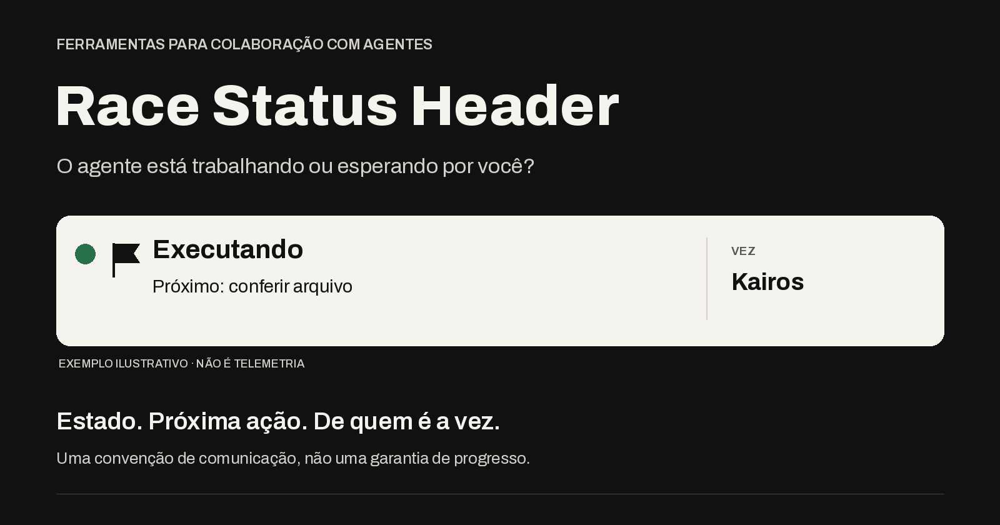

# race-status-header



**Autoria:** Vinicius Lara (euvinilara), com Hermes Agent.
**Versão:** 0.2.0 — convenção visual com plugin opt-in para Hermes.
**Licença:** MIT. Consulte [LICENSE](LICENSE).
**Repositório:** https://github.com/euvinilara/race-status-header

> Você não deveria precisar perguntar ao agente se ele está trabalhando ou esperando por você.

## Origem e proposta

Vini ficou sem saber se Kairos estava executando ou aguardando uma resposta.
Propôs um cabeçalho com sinaleiro e depois a metáfora de corrida. A proposta
transforma essa ambiguidade em estado, próxima ação e responsável visíveis,
sem fazer da corrida uma cobrança. Não inclui transcrições ou dados privados.

A primeira linha acompanha cada mensagem textual da conversa, salvo formatos
exatos, schemas de ferramentas e instruções superiores. O estado depende de
evidências: não é telemetria, monitor, processo ou garantia de progresso.
Sem imagens, integrações de mensageria, APIs externas ou alterações de infraestrutura.
Sem dependências de monitoramento; o helper opcional usa somente Python padrão.

## Exemplos rápidos (sintéticos)

| Bom | Por quê |
|---|---|
| 🟢 ⚑ Executando · Próximo: conferir arquivo · Vez: Kairos | A chamada de leitura começa nesta mesma resposta. |
| 🟡 ⚑ Aguardando você · Próximo: escolher opção · Vez: você | Uma decisão humana impede continuar. |
| 🔴 ⚑ Bloqueado · Próximo: renovar acesso · Vez: você | Acesso expirado foi confirmado; não esconder o impedimento. |
| 🏁 Concluído · Entrega: rascunho revisado | Só o rascunho foi concluído, não sua publicação. |
| 💬 Em conversa | Exploração sem transformar tudo em tarefa. |

**Ruins:** “Concluído” após mero despacho; “Executando” só porque apareceu
`running`; “Aguardando você” quando o agente pode continuar sozinho; sinalizar
só com cor; dizer “projeto concluído” quando apenas uma etapa terminou.

Em paralelo, manter um estado focal e uma nota, se relevante: “Rascunho entregue.
Outra frente: execução confirmada, resultado ainda não verificado.” Não chamar
esse conjunto de projeto concluído nem inventar notificações futuras.

Círculo colorido + ⚑ + palavras é intencional: bandeiras verdes/amarelas não
existem como emojis portáteis. A cor não é o único canal de informação.

`examples.json` contém cenários bons e ruins, com evidências **declaradas para
teste**, não observações reais. O helper verifica a coerência dessas declarações;
não compreende texto livre nem valida comportamento de um agente real.

## Instalação opt-in por perfil

Publicar o pacote **não** instala nem habilita nada. O plugin usa somente
`ctx.register_system_prompt_section` para registrar orientação estável de novas
sessões. Não intercepta respostas, adiciona ferramentas, injeta mensagens ou
faz chamadas de modelo. É orientação comportamental, não enforcement.

Requisitos: Python 3.10+ para o instalador; Hermes com
`PluginContext.register_system_prompt_section` e plugins opt-in por perfil.
Não presumimos uma versão mínima numérica do Hermes: verifique a capacidade.
Se a API não existir, o registro falha com mensagem explícita, sem fallback que
modifique contexto. Consulte os [plugins oficiais](https://hermes-agent.nousresearch.com/docs/user-guide/features/plugins)
e o [contrato de seções de prompt](https://hermes-agent.nousresearch.com/docs/user-guide/features/hooks#cache-safe-system-prompt-sections).
Plugins Python executam com permissões do usuário: revise o código antes de habilitar.

### Caminho local idempotente (recomendado)

1. Baixe/clone este repositório e revise o commit desejado. Confirme o diretório
   **existente** do perfil de destino; nunca deduza o destino por nome de agente.
2. No diretório do pacote, execute pelo `terminal`:
   `python3 -B install.py --home "CAMINHO_DO_PERFIL"`.
   Substitua o marcador pelo caminho real. O script não infere perfil ativo.
3. Confira os arquivos `plugins/race-status-header/{__init__.py,SKILL.md,plugin.yaml,LICENSE}`
   sob esse perfil. Nenhum `config.yaml` é criado ou editado pelo instalador.
4. Habilite explicitamente com o Hermes selecionando **o mesmo perfil** e confira
   `hermes plugins list`. Exemplos POSIX abaixo (em Windows, use os equivalentes
   de configuração de variáveis do seu shell, ou `hermes -p NOME` para um perfil
   nomeado cujo diretório você já confirmou):

```sh
# Ajuste ao perfil já verificado; estes comandos não reiniciam o gateway.
export HERMES_HOME="CAMINHO_DO_PERFIL"
unset HERMES_PROFILE
hermes plugins enable race-status-header --no-allow-tool-override
hermes plugins list
```

No Hermes, use `terminal(command="...")` com os comandos acima e o diretório de
trabalho do pacote. A instalação repetida com os mesmos quatro arquivos é no-op;
habilitar novamente mantém uma única entrada. Reinstalar **não** reabilita um
plugin desabilitado. Arquivos diferentes/symlinks são recusados, não sobrescritos.
Outros arquivos existentes são preservados. Não execute instalações/edições
concorrentes no mesmo destino. O helper é uma cópia offline de arquivos revisados,
não executa o scanner nem grava a metadata de instalação Git do instalador nativo.

### Alternativa: instalador Git nativo

Com o mesmo perfil selecionado, uma instalação inicial também pode usar:

```sh
hermes plugins install euvinilara/race-status-header --ref SHA_COMPLETO_REVISADO --no-enable
hermes plugins enable race-status-header --no-allow-tool-override
```

Substitua o marcador pelo SHA completo de 40 caracteres de um commit v0.2+;
não é uma tag nem abreviação. Este comando faz rede e o scanner nativo; não foi
exercitado como instalação remota neste pacote. O instalador nativo recusa um
destino existente: use o helper local para o no-op de conteúdo idêntico. Não use
`--force` para contornar divergência sem revisar e preservar o que já existe.
Se o CLI sugerir reiniciar o gateway, **não é necessário fazê-lo agora**: aguarde
seu próximo início natural. A mensagem do CLI não é prova de hot-load.

## Alcance real da ativação

| Situação | O que esperar |
|---|---|
| Nova sessão em novo processo CLI após instalar/habilitar | Orientação carregada automaticamente se o plugin registrar com sucesso. |
| Gateway já iniciado | Nenhuma promessa de hot-load, nem para novas conversas desse processo. Aguarde seu próximo início natural, sem restart provocado pelo pacote. |
| Gateway iniciado depois da ativação | Novas sessões podem receber a seção registrada no startup. Entrega em mensageria não foi testada aqui. |
| Sessão já aberta ou retomada com prompt persistido | Não reescrever prompt, histórico ou cache. Adotar por instrução futura na própria conversa. |
| Safe mode, registro incompatível ou conflito de seção | O plugin pode não carregar; examine o estado/erro do runtime. Instalação não prova registro. |

O core também pode omitir a seção se outros plugins consumirem o orçamento
agregado de prompt (8000 caracteres/32 seções no contrato consultado). O pacote
limita sua própria seção a 4000 caracteres; registro não garante inclusão quando
esse orçamento compartilhado acaba. Confira os avisos de construção do prompt.

Para uma conversa aberta, envie no **próximo turno normal**, junto ao seu pedido:

> A partir desta mensagem, adote a convenção race-status-header conforme o SKILL.md
> público deste pacote. Use estado baseado em evidência; preserve exceções de
> formatos exatos e instruções superiores. Não altere mensagens anteriores.

Forneça/carregue o `SKILL.md` se ele ainda não estiver no contexto. O plugin não
registra uma skill com namespace nem torna `skill_view` disponível por magia.
A adoção nessa conversa depende de o modelo seguir a instrução; não foi testada
como turno E2E. Não envie mensagens artificiais só para ativar cabeçalhos.

## Desabilitar, remover e atualizar

Com o mesmo perfil selecionado, pelo `terminal`:

```sh
hermes plugins disable race-status-header
hermes plugins list
```

Disable é idempotente; vale para managers carregados em novos processos.
**Não** retira uma orientação já congelada nem descarrega o gateway atual.
Para suspender numa conversa aberta, envie no próximo turno normal:
“Pare de usar os cabeçalhos race-status-header nesta conversa a partir de agora.”
O plugin permite essa escolha; obedecer continua sendo comportamento do modelo.

Desabilitar é a reversão operacional recomendada. Para remover arquivos, após
preservar eventuais alterações locais, use `hermes plugins remove race-status-header`
no perfil selecionado; confirme o prompt nativo somente para esse destino.
A remoção nativa não é apresentada como idempotente nem exercitada no probe.
Para atualizar uma instalação local divergente, desabilite, preserve/mova a
pasta antiga **para fora de plugins**, revise o novo pacote e instale/habilite.
Não mude outras skills, perfis, SOUL.md, sessões ou caches para tentar acelerar adoção.

## Uso manual sem plugin

A convenção continua utilizável só com `SKILL.md`: copie o pacote para uma pasta
`race-status-header` no diretório de skills do perfil escolhido e solicite seu
carregamento. Markdown não executa instalação nem garante ativação automática.
Não precisa instalar o plugin e a skill manual ao mesmo tempo.

## Verificação e testes

No diretório do pacote, via `terminal`:

```sh
python3 -B -m unittest -v test_static.py test_plugin.py test_install.py
```

`test_static.py` verifica frontmatter no subconjunto usado aqui, formato dos
cabeçalhos e 16 fixtures sintéticas. Não é parser YAML geral nem validador oficial
Hermes. `test_plugin.py` verifica registro com um contexto mínimo de teste;
`test_install.py` usa diretórios temporários. Nenhum deles mede conformidade de modelo.

Probe opcional com **o Python do ambiente do Hermes** e seu checkout:

```sh
CAMINHO_PYTHON_HERMES -B probe_runtime.py --runtime-source CAMINHO_CHECKOUT_HERMES
```

O probe cria perfis temporários, limpa variáveis herdadas e usa CLI de configuração,
loader, managers e `AIAgent`/prompt builder reais. Verifica instalação e enable/disable
repetidos, ausência de opt-in implícito, registro único no novo agente, ausência após
disable em manager novo e prompts preexistentes byte-idênticos. Compara também uma
lista de histórico **sintética**, não o banco de sessões operacional. Os imports
internos são adaptadores de teste, não dependências do plugin distribuído.

Não chama o modelo nem executa turnos CLI/gateway. Bloqueia conexões Python no
processo do probe; uma tentativa de buscar metadata do modelo pelo core pode
produzir aviso de rede bloqueada. Isso não é resposta de modelo fabricada.
Não testa entrega Telegram, sessões active/idle concorrentes, SQLite/resume E2E,
cache do provedor ou renderização em clientes. Execução local auditada em Linux;
portabilidade Python não equivale a testes em macOS/Windows.

Antes de alegar adoção real, confira uma resposta real da superfície desejada,
com evidência, escopo, próxima ação/dono e exceções. Nunca converta sucesso do
probe em garantia permanente do modelo. Veja [CHANGELOG.md](CHANGELOG.md).
